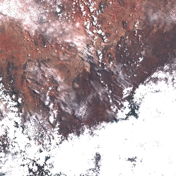
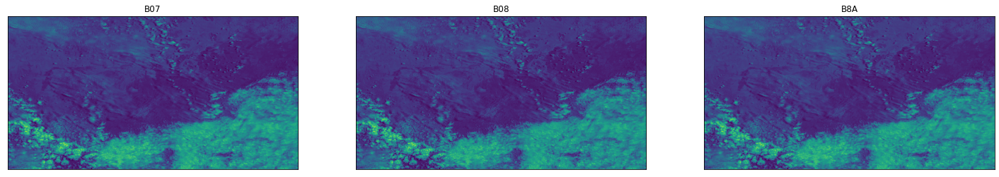
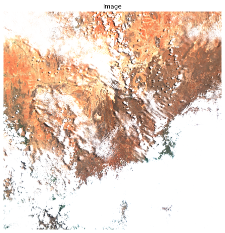

# Heth 🔨

> Classification using Sentinel2 dataset ( pretty much deeplearning from space 😅)

This an attempt at classification focusing on agriculture and settlements(maybe) using [Sentinel-2 Cloud-Optimized GeoTIFFs](https://aws.amazon.com/marketplace/pp/prodview-ykj5gyumkzlme?sr=0-7&ref_=beagle&applicationId=AWSMPContessa#usage)

For classification we need some labels so using an existing dataset of satellite images with classes that suit this from the Kaggle [Understanding the amazon from space data](https://www.kaggle.com/competitions/planet-understanding-the-amazon-from-space).

# Getting started

## Install some dependancies and do some imports

```python
pip install numpy matplotlib sat-search pyproj rasterio pyproj
```

```python
import satsearch
from json import load
import rasterio as rio
from rasterio.plot import show
from IPython.display import Image
import matplotlib.pyplot as plt

import torch
import numpy as np
```

## Region of interest

[geojson.io](https://geojson.io/) makes it simple to select a region on the map and save the feautures on file.

Then using this file and `satsearch` you can get a tiff of the region and time.

#### Read json and search

```python
file_content = load(open("../data/map.geojson"))
geometry = file_content["features"][0]["geometry"]
timeRange = '2022-01-01/2022-08-27'
SentinelSearch = satsearch.Search.search(
    url = "https://earth-search.aws.element84.com/v0",
    intersects = geometry,
    datetime = timeRange,
    collections = ['sentinel-s2-l2a-cogs'] )

items = SentinelSearch.items()
```

> Using `sentinel-s2-l2a-cogs` since it returns URLs instead of s3 object paths (personal preference over s3 paths)

### Get a preview

```python
Image(items[0].assets['thumbnail']['href'])
```



## Bands

```python
# some bands
bands = ['B07', 'B08', 'B8A']
fig = plt.figure(figsize=(25, 4))
for idx in range(len(bands)):
    ax = fig.add_subplot(1, 3, idx+1, xticks=[], yticks=[])
    plt.imshow(rio.open(items[0].assets[bands[idx]]['href']).read(1),aspect='auto')
    ax.set_title(bands[idx])
```



To get a true color image we need to combine the images from bands (B04, B03, B02) these bands are red, green, and blue respectively

```python

# Natural color
R = items[0].assets['B04']['href']
G = items[0].assets['B03']['href']
B = items[0].assets['B02']['href']
```

### e.g Info in a band

```python
items[0].assets['B04']
```

    {'title': 'Band 4 (red)',
     'type': 'image/tiff; application=geotiff; profile=cloud-optimized',
     'roles': ['data'],
     'gsd': 10,
     'eo:bands': [{'name': 'B04',
       'common_name': 'red',
       'center_wavelength': 0.6645,
       'full_width_half_max': 0.038}],
     'href': 'https://sentinel-cogs.s3.us-west-2.amazonaws.com/sentinel-s2-l2a-cogs/37/N/CA/2022/8/S2B_37NCA_20220826_0_L2A/B04.tif',
     'proj:shape': [10980, 10980],
     'proj:transform': [10, 0, 300000, 0, -10, 100020, 0, 0, 1]}

### Process and save natural color tiff

```python
R = rio.open(items[0].assets['B04']['href']) # get info from red band
true_color = rio.open('../data/sentinel/sample.tiff','w',driver='Gtiff',
                         width=R.width, height=R.height,
                         count=3,
                         crs=R.crs,
                         transform=R.transform,
                         dtype=R.dtypes[0]
                         )
true_color.write(rio.open(B).read(1),3) #blue
true_color.write(rio.open(G).read(1),2) #green
true_color.write(R.read(1),1) #red
true_color.close()
```

Once the `tiff` image is saved open it with something that can read this type of "image" e.g [QGIS](https://qgis.org/en/site/forusers/download.html) and you should be able to deselect the channels or etc.

> The resulted image will quiet big

#### Or you could try visualize it on a notebook either way

Open the image with rasterio and use matplotlib to plot it.

```python
image = rio.open('../data/sentinel/sample.tiff')
x = torch.from_numpy(np.int32(image.read()))
x = x.permute(1,2,0)
x = torch.clamp(x / 2000, min=0, max=1)
```

```python
fig, ax = plt.subplots(1, 1, figsize=(8, 8))
ax.imshow(x)
ax.axis("off")
ax.set_title("Image")
```

    Text(0.5, 1.0, 'Image')



## Inference

Run the inference py file providing the path to the checkpoint and the saved tiff file

```bash
python src/inference.py --model_path ckpt/model-epochepoch=05-val_lossval/model.ckpt --tiff_path data/sentinel/sample.tiff

# Predictions
[[1. 0. 0. 0. 0. 1. 1. 0. 0. 0. 1. 0. 1. 0. 0. 0. 1.]]

```

The predictions can then be inverse transformed using sklearns MultiLabelBinarizer
