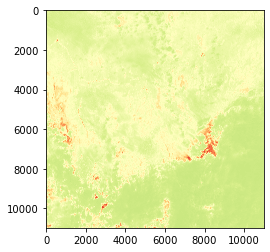

```python
from IPython.display import display, HTML
display(HTML("<style>.container { width:95% !important; }</style>"))
```


<style>.container { width:95% !important; }</style>


```python
# %pip install numpy
# %pip install matplotlib
# %pip install rasterio
# %pip install sat-search pyproj rasterio[s3] pyproj
# %pip install torchgeo
```


```python
import satsearch
from json import load
import rasterio as rio
from rasterio.plot import show
from IPython.display import Image
import matplotlib.pyplot as plt

import torch
import numpy as np
```


```python
file_path = "../data/map.geojson"
file_content = load(open(file_path))
geometry = file_content["features"][0]["geometry"]
timeRange = '2022-01-01/2022-08-27'
```


```python
SentinelSearch = satsearch.Search.search( 
    url = "https://earth-search.aws.element84.com/v0",
    intersects = geometry,
    datetime = timeRange,
    collections = ['sentinel-s2-l2a-cogs'] )

items = SentinelSearch.items()
```


```python
keys = set([k for i in items for k in i.assets])
```


```python
# Visualize some items thumbnail
Image(items[0].assets['thumbnail']['href'])
```


    

    


```python
# some bands
bands = ['B07', 'B08', 'B8A']
fig = plt.figure(figsize=(25, 4))
for idx in range(len(bands)):
    ax = fig.add_subplot(1, 3, idx+1, xticks=[], yticks=[])
    plt.imshow(rio.open(items[0].assets[bands[idx]]['href']).read(1),aspect='auto')
    ax.set_title(bands[idx])
```


    

    


```python
# Some band combinations
# agriculture and true color bands B11, B8, B2, B4, B3, B2

# Natural color
R = items[0].assets['B04']['href']
G = items[0].assets['B03']['href']
B = items[0].assets['B02']['href']

# agriculture
B8 = items[0].assets['B08']['href']
B11 = items[0].assets['B11']['href']

items[0].assets['B04']['proj:shape']
```


    [10980, 10980]


```python
items[0].assets['B04']
```


    {'title': 'Band 4 (red)',
     'type': 'image/tiff; application=geotiff; profile=cloud-optimized',
     'roles': ['data'],
     'gsd': 10,
     'eo:bands': [{'name': 'B04',
       'common_name': 'red',
       'center_wavelength': 0.6645,
       'full_width_half_max': 0.038}],
     'href': 'https://sentinel-cogs.s3.us-west-2.amazonaws.com/sentinel-s2-l2a-cogs/37/N/CA/2022/8/S2B_37NCA_20220826_0_L2A/B04.tif',
     'proj:shape': [10980, 10980],
     'proj:transform': [10, 0, 300000, 0, -10, 100020, 0, 0, 1]}


```python
# Process and save natural color tiff
R = rio.open(items[0].assets['B04']['href']) # get info from red band
true_color = rio.open('../data/sentinel/sample.tiff','w',driver='Gtiff',
                         width=R.width, height=R.height,
                         count=3,
                         crs=R.crs,
                         transform=R.transform,
                         dtype=R.dtypes[0]
                         )
true_color.write(rio.open(B).read(1),3) #blue
true_color.write(rio.open(G).read(1),2) #green
true_color.write(R.read(1),1) #red
true_color.close()
```


```python
R,G,B
```


    (<open DatasetReader name='https://sentinel-cogs.s3.us-west-2.amazonaws.com/sentinel-s2-l2a-cogs/37/N/CA/2022/8/S2B_37NCA_20220826_0_L2A/B04.tif' mode='r'>,
     'https://sentinel-cogs.s3.us-west-2.amazonaws.com/sentinel-s2-l2a-cogs/37/N/CA/2022/8/S2B_37NCA_20220826_0_L2A/B03.tif',
     'https://sentinel-cogs.s3.us-west-2.amazonaws.com/sentinel-s2-l2a-cogs/37/N/CA/2022/8/S2B_37NCA_20220826_0_L2A/B02.tif')


```python
image = rio.open('../data/sentinel/sample.tiff')
```


```python
np.int32(image.read())
```


    array([[[3752, 3712, 3824, ..., 2060, 1986, 1882],
            [3544, 3584, 3720, ..., 2040, 1678, 1778],
            [3444, 3384, 3536, ..., 2022, 1692, 1882],
            ...,
            [2466, 2318, 2182, ..., 4276, 4320, 4272],
            [2132, 2010, 2060, ..., 4020, 4048, 3960],
            [1728, 1802, 2194, ..., 3572, 3680, 3660]],
    
           [[3240, 3208, 3344, ..., 1432, 1304, 1314],
            [3184, 3052, 3100, ..., 1368, 1162, 1194],
            [2996, 2742, 2786, ..., 1366, 1210, 1278],
            ...,
            [2792, 2620, 2564, ..., 3876, 3952, 3916],
            [2548, 2342, 2410, ..., 3376, 3472, 3520],
            [2142, 2128, 2414, ..., 2980, 3044, 3296]],
    
           [[3168, 3094, 3052, ..., 1056,  983,  936],
            [3062, 2880, 2740, ..., 1082,  880,  904],
            [2842, 2514, 2386, ..., 1054,  907,  962],
            ...,
            [2976, 2764, 2744, ..., 3504, 3552, 3604],
            [2806, 2536, 2750, ..., 3136, 3168, 3328],
            [2452, 2298, 2566, ..., 2854, 3044, 3276]]], dtype=int32)


```python

```


```python
x = torch.from_numpy(np.int32(image.read()))
```


```python
x = x.permute(1,2,0)
```


```python
x = torch.clamp(x / 2000, min=0, max=1)
```


```python
fig, ax = plt.subplots(1, 1, figsize=(8, 8))
ax.imshow(x)
ax.axis("off")
ax.set_title("Image")
```


    Text(0.5, 1.0, 'Image')


    

    


```python
B08 = items[0].assets['B08']['href']
R = items[0].assets['B04']['href']
B08, R
```


    ('https://sentinel-cogs.s3.us-west-2.amazonaws.com/sentinel-s2-l2a-cogs/37/N/CA/2022/8/S2B_37NCA_20220826_0_L2A/B08.tif',
     'https://sentinel-cogs.s3.us-west-2.amazonaws.com/sentinel-s2-l2a-cogs/37/N/CA/2022/8/S2B_37NCA_20220826_0_L2A/B04.tif')


```python

```


```python
# (B08 - B04) / ((B08 + B04) + 1e-10)
# NDVI stuff
B04 = rio.open(B08).read()
B08 = rio.open(R).read()
```


```python
ndvi = (B08.astype(float) - B04.astype(float)) / ((B08.astype(float) + B04.astype(float)) + 1e-10)
show(ndvi, cmap="RdYlGn")
```


    

    


    <AxesSubplot:>


```python
ndvi = (B08.astype(float) - B04.astype(float)) / ((B08.astype(float) + B04.astype(float)))
show(ndvi, cmap="RdYlGn")
```


    

    


    <AxesSubplot:>


```python

```
